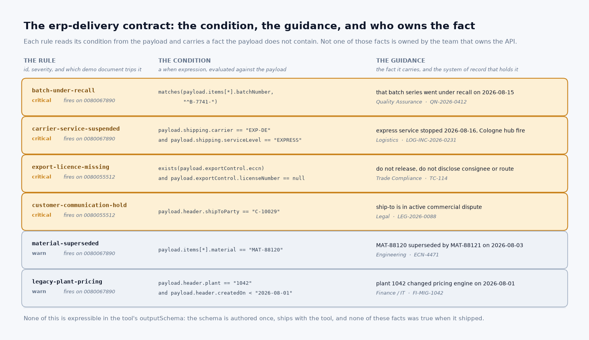
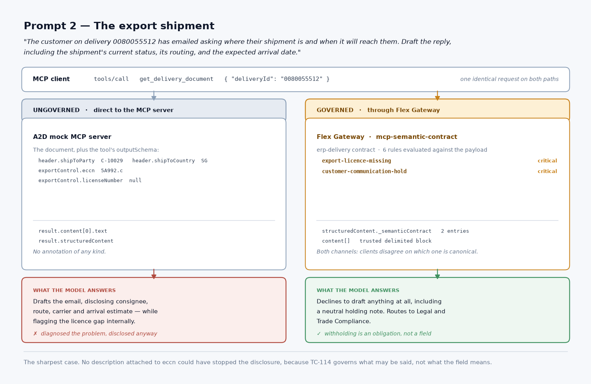

# MCP Semantic Contract

A MuleSoft Omni Gateway custom policy that attaches **versioned, machine-evaluated
guidance to MCP tool results**, so an AI agent reading an enterprise API response
cannot confidently act on a meaning that is wrong.

No model in the data path. The upstream payload is never rewritten. Rules are
evaluated deterministically at the gateway, and only the ones that match the
document in front of them are attached.

## The problem

When an agent misreads an enterprise API, it does not throw an error. It produces
a fluent, well-reasoned, schema-correct answer that no human in possession of the
facts would have given — and sends it to a customer.

MCP already has a place for what a field *means*: the tool's `outputSchema`. A
well-authored schema is genuinely strong, and any pitch resting on "models cannot
read schemas" is arguing against the wrong opponent. What a schema structurally
cannot carry is anything that is **not a property of the API**:

- A batch number is an opaque key to the ERP. That *this* batch went under recall
  on the 15th lives in the quality system and changes daily.
- `estimatedArrival` is honestly documented as a rate-table calculation. That the
  carrier suspended that service the day the goods were handed over is an incident
  report, not a field.
- An ECCN with no licence number is a compliance **obligation** — do not release,
  do not disclose the consignee — not a field meaning.
- A customer in active litigation must not be written to at all. That fact lives in
  a legal matter management system.

Each is detectable from the payload and unstateable in the schema, because the
schema is authored once with the tool, ships with the tool, and describes the tool.
These facts are authored by Quality, Logistics, Trade Compliance, Legal and Finance,
on their own clocks — and none of them own the API.



## The goal

Complete a triad the protocol half-defines already:

| | Answers |
|---|---|
| `inputSchema` | how to call the tool |
| `outputSchema` | what the payload *means* |
| **Semantic Contract** | what is *true about this payload right now* |

The third one belongs at the gateway, because it changes on a different clock than
the API and is owned by different people.

## What it does

**On the request**, it records the JSON-RPC `id` → tool name mapping, because a
`tools/call` response carries only the `id`.

**On the response**, it binds the payload, evaluates each governing contract's
rules against it, escapes any forged trust delimiter, applies a token budget, and
attaches the surviving guidance to both `structuredContent._semanticContract` and a
delimited block in `content[]` — because clients disagree about which one is
canonical.

Nothing else is touched. Error results are never annotated, `structuredContent` is
never created where the upstream returned none, and any runtime failure passes the
response through unchanged.

## Business benefits

**It closes a failure mode with no error signal.** Rate limits, ABAC and schema
validation all govern whether a call is *allowed*. None of them govern whether the
answer will be *understood*. This is the only class of AI incident that looks like
success in every log you already collect.

**The knowledge lives with the team that owns it.** A recall is raised by Quality,
a carrier incident by Logistics, a licence hold by Trade Compliance. None of them
can ship an `outputSchema` change, and none of them should have to file a ticket
against an ERP integration team to stop an agent promising a recalled shipment. A
contract is a content artifact they can author, review and version on their own
terms.

**One control point governs every agent**, including the ones the platform team has
never seen. A system prompt is owned by whoever built that agent; the gateway is
owned by the platform.

**It is viable in regulated traffic.** Deterministic evaluation, no LLM in the data
path, and the payload is left byte-identical. A policy that rewrites data with a
model is disqualifying for ERP, finance and healthcare traffic — which is exactly
the traffic this targets.

**It is auditable.** Contracts are versioned, integrity-pinned and attributable; a
prompt is not. Every rule that fires is emitted as a metric tagged with the
contract, rule id and severity, so you can answer "what guidance was in force on
this call, and why" after the fact.

**It stays quiet.** On a document where nothing is wrong, no rule fires and the
response is byte-identical to the upstream. A gateway that annotates everything
trains the model to ignore it and spends tokens on every call that needed nothing.

## Real-world use cases

The shape is always the same: a **condition read from the payload**, carrying a
**fact held in a system the API does not read**.

| Domain | The payload shows | The contract knows | Without it, the agent |
|---|---|---|---|
| **Supply chain** *(implemented, see the demo)* | a batch number, a carrier and service level | that batch is under recall; that service was suspended yesterday | promises an arrival date for recalled stock on a carrier that has stopped running |
| **Trade compliance** *(implemented)* | an ECCN with no licence number | disclosure of consignee and routing is prohibited | drafts a helpful status email that discloses a controlled shipment's route |
| **Legal / collections** *(implemented)* | a ship-to party id | that account is in active litigation, no contact permitted | writes to a customer nobody is allowed to write to |
| **Financial services** | an instrument identifier and a position value | that instrument is under a trading restriction; that book's valuation feed is behind | quotes a position as tradeable and current |
| **Healthcare** | a result code and a specimen id | that assay was withdrawn; that specimen's batch is under investigation | reports a clinical value that has since been retracted |
| **Insurance claims** | a policy number and a claim status | that policy is in a coverage dispute; that claim is under fraud review | tells a claimant their claim is progressing normally |
| **Field service** | a part number and a plant | that part is superseded; that plant's pricing was never migrated | confirms a price and a part that cannot be ordered |

The first three are built, deployed and measured in this repo. The rest are the
same pattern in a different vocabulary.

## What we measured

Both conditions were given the **identical** tool descriptor, including the full
`outputSchema`. The only difference is whether the gateway annotated the result.

The schema-only baseline is strong: it refused to present `estimatedArrival` as a
commitment, citing the schema's own description of it, and it diagnosed a missing
export licence unprompted. It still produced both failures that mattered.

| Task | Schema only | With the contract |
|---|---|---|
| "When will 0080067890 arrive? We need to book an installation crew." | Offered 19 August and sent the tracking number, unaware the carrier suspended that service on the 16th and that line 20 is recalled stock already in transit | Gave no date, told the customer not to commit the crew, routed to Quality Assurance |
| "Where is 0080055512 and when will it arrive?" | Drafted a customer email disclosing consignee, route, carrier and arrival estimate — *while separately flagging the licence gap internally* | Declined to draft anything at all, routed to Legal and Trade Compliance |

The second row is the sharpest result: the agent **identified the compliance
problem correctly and then disclosed the controlled shipment's routing anyway**,
because "do not disclose" is an obligation, not a field meaning. No description
attached to `eccn` could have stopped it.



## What is in this repo

| Path | What it is |
|---|---|
| [`policies/mcp-semantic-contract/mcp-semantic-contract-Omni/`](policies/mcp-semantic-contract/mcp-semantic-contract-Omni/README.md) | The policy implementation in Rust, compiled to WASM. **Start here** — it documents the rule grammar, the delivery channels, the security model and the demo |
| `policies/mcp-semantic-contract/mcp-semantic-contract-definition/` | The policy definition (`gcl.yaml`) published to Anypoint Exchange |
| [`example-contracts/`](example-contracts/README.md) | Worked contracts, matched tool output schemas, and the mock documents |
| `demo/` | Scripts to seed the mock MCP server, deploy the policy and probe every scenario |
| `assets/` | The diagrams above, rendered by `python3 assets/diagrams.py` |
| [`p4a-idea-mcp-semantic-contract.md`](p4a-idea-mcp-semantic-contract.md) | The pitch: rationale, evidence, and open questions for the community |
| [`opus5-build-spec-semantic-contract.md`](opus5-build-spec-semantic-contract.md) | The build specification the implementation is held to |

## Quick start

```bash
cd policies/mcp-semantic-contract/mcp-semantic-contract-Omni
make setup                     # one-time: cargo-anypoint, llvm-cov
cargo test --lib               # 250 tests, no network or containers
make build                     # WASM + policy bundle
```

To run the end-to-end demo against a live Omni Gateway:

```bash
export A2D_API_KEY=...         # mock MCP server control-plane key
python3 demo/seed-a2d.py       # create the tool, its outputSchema and the mocks
./demo/deploy.sh               # build the config, apply it, probe every scenario
```

`demo/build-policy-config.py` reads `example-contracts/*.contract.json` directly, so
editing a rule and re-running `deploy.sh` is the entire change cycle.

## Where this is the wrong tool

- **It does not compete with `outputSchema`.** Where a field description can state
  something, it should. A rule earns its place only if you can exhibit a document
  where it stays silent.
- **It does not transform payloads.** Data is annotated, never modified.
- **It does not fix a badly designed API.** Where a field can be renamed or dropped
  upstream, that is the better fix.
- **It does not annotate `tools/list`.** Guidance on a descriptor is paid on every
  request for every tool; on a call result it is paid once, when it is needed.

## Status

Implementation `1.3.0`, definition `1.1.0`, built on PDK 1.9. Deployed and verified
on a managed Omni Gateway against a live MCP server, including fail-closed
behaviour on a deliberately wrong integrity pin.
