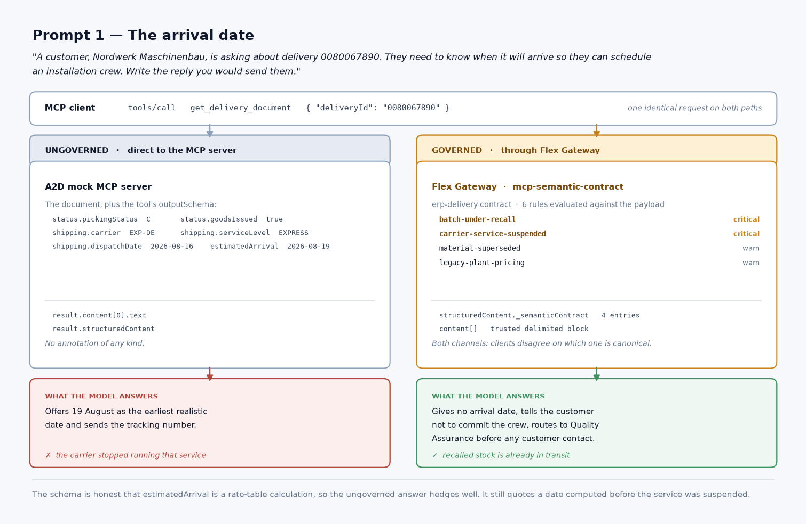
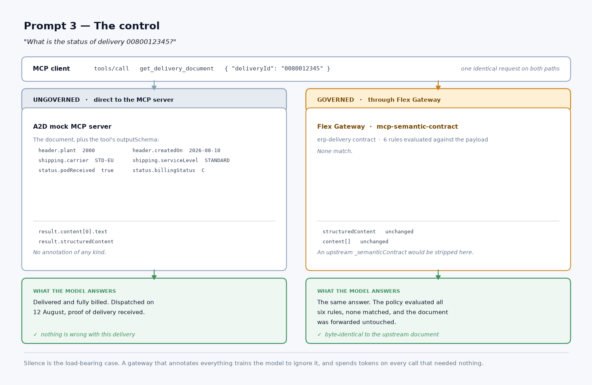
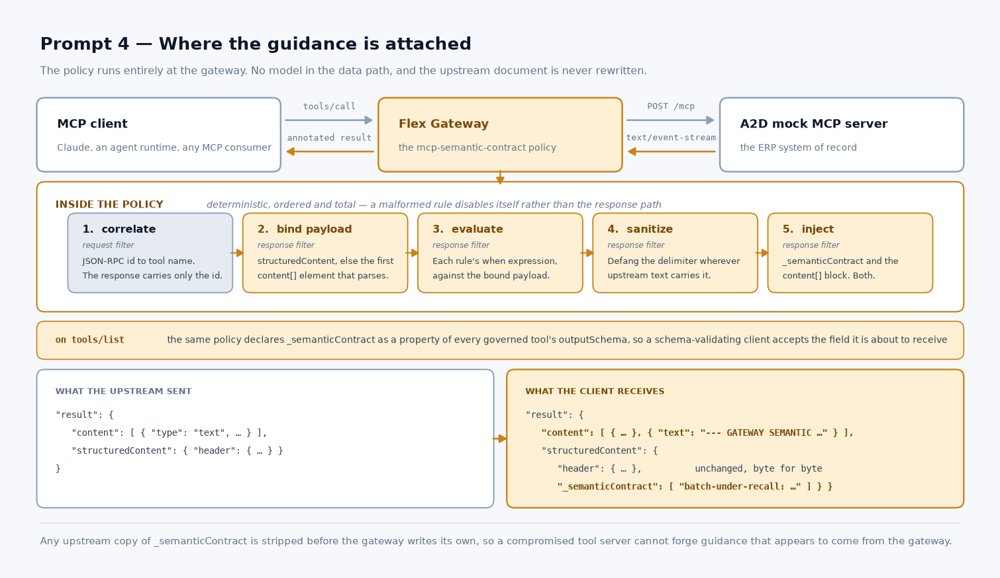
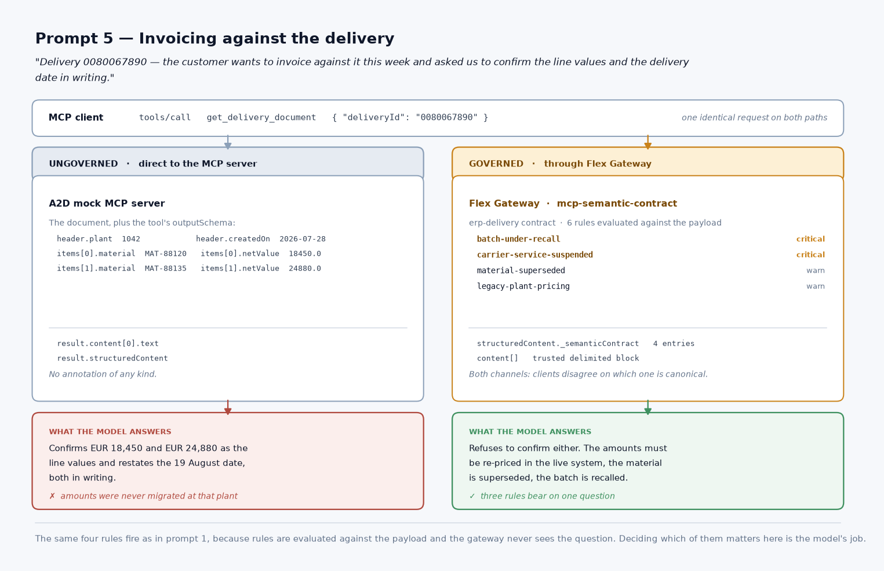

# MCP Semantic Contract

A Flex Gateway custom policy that attaches a versioned, machine-evaluated
**semantic contract** to MCP tool results, so a model interpreting an ERP
response cannot quietly get the meaning wrong.

The problem it solves: `deliveredQuantity: 288` looks like "288 units shipped".
In SAP SD it means 288 units *staged for delivery*; nothing has shipped until
`goodsIssuedQuantity > 0`. An empty `holds: []` looks like "no holds" but often
means "holds you are not allowed to see". No amount of prompt engineering fixes
this, because the ambiguity is in the payload, not the prompt.

This policy evaluates rules against the tool result and appends the ones that
fire as a delimited, gateway-authored block in `result.content[]`.

## What it does

**Request phase** — removes the upstream timeout (`x-envoy-upstream-rq-timeout-ms: 0`)
and records the JSON-RPC `id` → tool name mapping, because a `tools/call`
response does not carry the tool name. Batches are correlated per element.

**Response phase** — for each JSON-RPC result:

1. Binds a payload: `result.structuredContent`, else the first `content[]` text
   element that parses as JSON. Neither present means only `always` rules apply.
2. Evaluates each governing contract's rules against it.
3. Suppresses rules already delivered to this session, if configured.
4. Applies the token budget.
5. Escapes any occurrence of the trusted delimiter in upstream text.
6. Appends one text element with the surviving guidance.

### Invariants

- The upstream document inside `result.structuredContent` is byte-identical,
  except that a forged delimiter is defanged in place. The only field the policy
  adds there is `_semanticContract`, which it owns outright.
- Existing `content[]` elements are never replaced, only appended to.
- Error results (`isError: true`, JSON-RPC `error`) are never annotated, and
  `tools/list` results are only ever amended to declare `_semanticContract`.
- `structuredContent` is never created where the upstream returned none.
- Any runtime failure passes the response through unchanged. Config errors fail at load.

## What belongs in a contract, and what belongs in `outputSchema`

A rule earns its place here only if its truth depends on the payload. Anything
that is true of a field on every call is a field description, and MCP already
has a place for it: the tool's `outputSchema`, which clients read once at
discovery and which works with no gateway in front of it.

The test for a rule is whether you can exhibit a document where it stays
silent. "`deliveredQuantity` counts staged stock, not shipped stock" is true
always, so it is a schema description. "Nothing on this order has shipped" is
true only when `deliveredQuantity > 0` and `goodsIssuedQuantity == 0`, which no
field description can express, so it is a rule.

Getting this wrong is expensive in both directions. Static meaning encoded as a
rule is paid for on every single call and only reaches clients behind the
gateway. Conditional meaning pushed into a description either has to be
hedged into uselessness ("may indicate...") or asserts something false on the
calls where the condition does not hold.

The shipped ERP example splits accordingly: `example-contracts/erp-sales-order.outputschema.json`
carries the vocabulary, `example-contracts/erp-sales-order.contract.json` carries five
cross-field conclusions. `schema_split_tests` pins the boundary by proving each
surviving rule has a payload that silences it, so a field description cannot
drift back into the contract unnoticed.

Three things still need the gateway even when the schema is perfect: the
schema is advisory and the upstream can contradict it, whereas the injected
block is authored at the trust boundary and delimiter-anchored; conditions
spanning fields the tool owner does not control (replication lag, caller role)
are not expressible in a schema; and rule firings are observable per call,
which descriptions are not.

### Two classes of rule, and only one is safe from a good schema

Being conditional is necessary but not sufficient. Measured against a capable
model reading a well-authored `outputSchema`, the sales order rules turned out
to be largely redundant: told once that `deliveredQuantity` counts staged stock,
the model works out on its own that nothing has shipped. A conditional rule of
that kind buys salience, not knowledge, and salience is a weak thing to build a
platform capability on.

The rules that cannot be dissolved into a schema are the ones whose *guidance*
states a fact the payload does not contain and the schema author could not have
known:

| | Sales order contract | Delivery contract |
|---|---|---|
| Condition | payload fields | payload fields |
| Guidance | a conclusion derivable from those fields | a fact held in another system |
| Author | the API owner | Quality, Logistics, Trade Compliance, Legal |
| Changes | when the API changes | daily |
| A great schema makes it | redundant | no less necessary |

`example-contracts/erp-delivery.contract.json` is built entirely from the second kind. A
batch number is an opaque key to the ERP; that batch being under recall
`QN-2026-0412` since 2026-08-15 lives in the quality system. `estimatedArrival`
is honestly documented as a rate-table calculation; that the carrier suspended
the service on the day it was handed over is an incident report. No description written
when the tool shipped could carry either, because neither was true then.

`overlay_tests` pins this stronger property mechanically: every rule cites a
reference — a recall number, an incident id, a compliance standard — and the
test fails if that identifier appears anywhere in the payloads the tool can
return. A fact the document already states belongs in the schema.

## Delivery: two channels, because clients disagree

Appending a text element to `content[]` is not sufficient on its own. A client
whose tool declares an `outputSchema` treats `structuredContent` as the
canonical result, and may drop the extra element entirely — Claude Code does
exactly this, which made an earlier version of this policy completely invisible
to it while appearing to work on the wire. Guidance therefore goes to both:

| Upstream result | Channel |
|---|---|
| `structuredContent` present | `_semanticContract` array inside it, **and** the `content[]` block |
| No `structuredContent` | the `content[]` block only |

Both carry identical text. The duplication is deliberate: clients predating
structured output never look at `structuredContent`, and clients built around it
may never look at `content[]`. `structuredContent` is never created where the
upstream returned none, because a tool that declares no `outputSchema` must not
start returning structured output just because a policy sits in front of it.

`semantic_contract.guidance_delivered` reports which channels carried a given
response. `structured=false` on a tool that declares an `outputSchema` is worth
alerting on: it means a schema-aware client saw nothing.

**The structured channel needs no delimiter.** The gateway strips
`_semanticContract` from every upstream result before deciding whether to write
its own — on error results, on uncovered tools, and when no rule fires. Where
delimited text can only be escaped after the fact, this field cannot be forged
at all, because nothing an upstream sends in it ever survives. So that a
schema-validating client accepts the field, the policy declares it on the
`outputSchema` of every governed tool as `tools/list` passes through.

## Security: the delimiter is the trust anchor

This policy writes instruction-shaped text into the tool result stream, which is
structurally identical to a tool-poisoning attack. The only thing separating the
gateway's guidance from a compromised upstream's is the delimiter, so **every
occurrence of the delimiter in upstream content is escaped before the trusted
block is appended**. A consumer splitting on the delimiter finds exactly one
block, and it is the gateway's.

Sanitization covers both copies of the document. `content[]` text elements and
every string and object key inside `structuredContent` are scanned, because a
tool that declares an `outputSchema` must return structured content and the MCP
spec tells clients to prefer it — leaving it alone would put the forgery on the
path clients read first. Defanging runs after rule evaluation, so it can never
change which rules fired, and a document that never carried the delimiter comes
out byte-identical.

The guarantee is about authorship, not content. Defanging stops upstream text
from *speaking as the gateway*; it does not scrub the payload. Instruction-shaped
prose sitting in a legitimate field is still there to be read, and no gateway
policy can tell you that a customer's name is a lie.

`semantic_contract.delimiter_sanitized` fires when this happens. Alert on it: a
backend emitting the gateway's delimiter is either badly broken or hostile.

Fetched contracts are hash-pinned. `remoteContract.integrity` is mandatory when
`remoteContractUrl` is set, and content that fails the pin is dropped entirely
rather than partially applied — including on refresh, where the last verified
copy keeps governing.

## Configuration

```yaml
- policyRef:
    name: mcp-semantic-contract-flex-v1-0
  config:
    envelope:
      delimiter: "--- GATEWAY SEMANTIC CONTRACT (trusted) ---"
      sanitizeUpstreamDelimiter: true
    contracts:
      - contractId: erp-sales-order
        format: json           # json | markdown | text
        toolMapping: [get_sales_order]
        inline: |-
          {"semanticContractVersion":"1.0", ...}
    # Optional hash-pinned artifact, fetched at startup and on TTL expiry.
    remoteContractUrl: https://contracts.internal/erp-sales-order.json
    remoteContract:
      contractId: erp-remote
      integrity: "sha256:<64 hex chars>"   # mandatory when the URL is set
      cacheTtlSeconds: 900
      onFetchFailure: useStale             # useStale | passThrough
      toolMapping: [get_sales_order]
    merge:
      order: [json, markdown, text]
      globalMaxTokens: 4000
      duplicateRuleIds: firstWins
      onBudgetExceeded: dropBySeverity
    dedupe:
      injectOncePer: call        # call | session
      sessionTtlSeconds: 900
    sse:
      mode: passThrough          # passThrough | annotate
      streamTimeoutMillis: 60000 # only under annotate
    warnOnUncoveredTools: true
```

`contractId` in the binding always wins over the one inside the artifact: dedupe
keys and metric tags are namespaced by it, so a fetched contract must not be able
to rename itself into another contract's namespace.

## Contract formats

**JSON** (`example-contracts/semantic-contract-v1.schema.json`) is the only format with
conditional rules:

```json
{
  "id": "shipped-means-goods-issued",
  "severity": "critical",
  "when": "payload.items[0].deliveredQuantity > 0 and payload.items[0].goodsIssuedQuantity == 0",
  "guidance": "deliveredQuantity counts stock staged for delivery, not stock that has left the warehouse."
}
```

**Markdown** takes metadata from YAML frontmatter and treats the whole body as
one unconditional rule. Frontmatter is required; use `text` for prose without it.

**Text** is one unconditional rule; the binding supplies tool mapping and severity.

## Writing rules: the `when` expression

A rule is a small object. `id` and `severity` and `guidance` are required, one
of `when` or `always` must be present, and `reference` is optional and never
injected:

```json
{
  "id": "export-licence-missing",
  "severity": "critical",
  "when": "exists(payload.exportControl.eccn) and payload.exportControl.licenseNumber == null",
  "guidance": "The goods on this delivery are export controlled but no licence is recorded against it. Under trade compliance standard TC-114 the goods may not be released...",
  "reference": "TC-114"
}
```

`when` is evaluated against the **bound payload**: `result.structuredContent` if
the tool returned it, otherwise the first `content[]` text element that parses
as JSON. Every path is rooted at `payload`, which is that document — not the
JSON-RPC envelope. There is no way to reach `result`, the request arguments, or
anything outside the payload.

`always: true` is the alternative, and fires on every call the contract governs.
It is mutually exclusive with `when`. Reach for it rarely: a rule that fires
unconditionally is a field description, and it belongs in `outputSchema`.

### Grammar (`jsonpath-subset`)

```
expr    := or
or      := and ( "or" and )*
and     := cmp ( "and" cmp )*
cmp     := operand ( ("==" | "!=" | ">" | "<" | ">=" | "<=") operand )?
operand := path | literal | "sizeOf" "(" path ")" | "exists" "(" path ")"
path    := "payload" ( "." field | "[" integer "]" )*
literal := string | number | "true" | "false" | "null"
```

| Element | Notes |
|---|---|
| Paths | `payload.header.plant`, `payload.items[0].batchNumber`. Object keys and integer indices only. |
| `==` `!=` | Structural equality against any type. Numbers compare by value, so `1` equals `1.0`. |
| `>` `<` `>=` `<=` | Defined for number/number and string/string only. Strings compare lexicographically. |
| `sizeOf(path)` | Array length. `0` for anything that is not an array, missing included. |
| `exists(path)` | True when the path resolves to a non-`null` value. |
| `and` `or` | `and` binds tighter. **No parentheses.** |
| Bare operand | A condition with no operator is true only for literal boolean `true`. Truthy strings and non-zero numbers are false. |

Strings are double-quoted, which means escaping inside JSON:
`"payload.credit.creditStatus == \"B\""`. Supported escapes are `\"`, `\\`,
`\n` and `\t`.

### Evaluation is total

An expression can never error at request time, so a contract author cannot take
down the response path with a bad rule:

| Situation | Result |
|---|---|
| Missing path | `null` |
| Type mismatch in a comparison | `false` |
| Ordering against `null` | `false` |
| `sizeOf` of a non-array | `0` |
| `exists` of `null` or missing | `false` |
| Non-boolean as a bare condition | `false` |

The cost of totality is that a typo is silent. `payload.header.plnt == "1042"`
resolves to `null`, compares false, and the rule simply never fires. Nothing
warns you. This is why every rule should have a test that proves it *does* fire
on the payload it was written for, not only one that proves it stays quiet.

A `when` that fails to *parse* is different: it disables **that rule only**, with
a load warning, and the rest of the contract still governs.

### Patterns worth knowing

**Two fields that must agree.** The most common shape — a conclusion neither
field states alone.

```
payload.items[0].deliveredQuantity > 0 and payload.items[0].goodsIssuedQuantity == 0
```

**Presence together with absence.** `exists` for the thing that is set, `== null`
for the thing that is missing.

```
exists(payload.exportControl.eccn) and payload.exportControl.licenseNumber == null
```

**An empty collection used as evidence.** `sizeOf` is the only way to ask about
array length, and combining it with a second field is what turns "no records"
into "records you cannot see".

```
sizeOf(payload.holds) == 0 and payload.header.deliveryBlock != null
```

**A threshold.**

```
payload.meta.replicationLagSeconds > 300
```

**Effective dating.** There is no date type and no date arithmetic, but ISO-8601
dates sort correctly as strings, so ordering comparisons work on them directly.
This is how a migration cutover or a policy start date is expressed.

```
payload.header.plant == "1042" and payload.header.createdOn < "2026-08-01"
```

**Set membership, spelled out.** There is no `in` operator and no way to iterate
an array, so a value that may appear on any line has to be checked per index.

```
payload.items[0].batchNumber == "B-7741-2026" or payload.items[1].batchNumber == "B-7741-2026"
```

This is the dialect's sharpest limitation. It is bounded and explicit rather
than clever, which is deliberate — but it does mean a rule written for two lines
silently misses a third. Where the check matters, cover more indices than the
documents you have seen, and remember that a missing index resolves to `null`
and compares false rather than erroring.

### The precedence trap

`and` binds tighter than `or` and there are **no parentheses**, so this:

```
payload.a == 1 and payload.b == 2 or payload.c == 3
```

means `(a AND b) OR c`, never `a AND (b OR c)`. The parser rejects `(` outright
rather than silently mis-parsing it, so you find out at load time. To express
`a AND (b OR c)`, split it into two rules with distinct ids and the same
guidance, or restructure the condition.

### Choosing a severity

| Severity | Meaning | Budget behaviour |
|---|---|---|
| `critical` | Acting without this produces a wrong answer that reaches a customer | Never dropped |
| `warn` | Materially changes the answer, but omitting it is not itself an error | Dropped after `info` |
| `info` | Useful context | Dropped first |

Severity is a budget instruction, not a tone marker. Since the budget drops
whole rules and never truncates, marking everything `critical` does not make
guidance more likely to be read — it removes the gateway's ability to choose
sensibly when the budget binds, and pushes the block past the point where a
model attends to any of it.

### Writing the guidance itself

The guidance is the only part the model ever sees. `id` prefixes the line,
`reference` is never injected.

State the conclusion about *this* payload, not the vocabulary of the field. The
schema already defines what `deliveredQuantity` means; the rule's job is to say
that nothing has shipped. Keep it to a sentence or two — `schema_split_tests`
fails any injected line, `id` prefix included, longer than 260 characters, on
the grounds that a rule growing into documentation belongs in the schema.

Say what not to do, concretely. "Do not quote it as the expected delivery date"
survives contact with a model that wants to be helpful; "this date may be
unreliable" does not.

## Token budget

Cost is `chars / 4`, summed across all contracts for one result, including the
delimiter line. Over budget, whole rules are dropped — never truncated — `info`
first, then `warn`, taking the last-declared rule of a severity first so the
surviving set is deterministic. `critical` rules are never dropped; if they alone
exceed the budget they are injected anyway and
`semantic_contract.rules_dropped_budget` records it.

## Deduplication

`injectOncePer: call` repeats guidance on every call. `session` suppresses a rule
already delivered, keyed on `Mcp-Session-Id`, falling back to the authenticated
subject. A rule that starts firing later still gets through — only repeats of the
same rule are suppressed.

Dedupe state lives in PDK local storage, which is per-replica. Across replicas a
rule may be delivered once per replica. `call` scope is unaffected.

## Transport scope

JSON bodies always. `text/event-stream` responses depend on `sse.mode`, which
defaults to `passThrough` — the stream is forwarded untouched and
`semantic_contract.sse_skipped` fires.

This matters more than it sounds. A streamable-HTTP MCP server may answer a
`tools/call` POST with SSE rather than JSON, and some only do that: the A2D mock
used for the demo frames **every** result as `text/event-stream` and rejects an
`Accept` header that omits it. Under the default the policy governs nothing on
such a server.

`sse.mode: annotate` handles it. Frames are buffered to end of stream, each
`data:` payload that parses as JSON-RPC is annotated, and everything else —
event names, ids, comments, retry hints, non-JSON frames such as `[DONE]` — is
re-emitted verbatim. A stream no rule fires on is forwarded byte-for-byte rather
than re-serialised.

The cost is that annotating requires waiting for the stream to close, so an
upstream that holds the response open would otherwise stall the response
indefinitely. `streamTimeoutMillis` bounds that wait and replaces the
`x-envoy-upstream-rq-timeout-ms: 0` the policy sets under `passThrough`. This is
why the mode is opt-in: enabling it trades unlimited call duration for the
ability to govern streamed results. Server-initiated SSE channels are unaffected
either way, since the policy only ever touches POST responses.

## Observability

PDK exposes no counter primitive, so these are emitted as `logger::info!` lines
with a fixed `semantic_contract_metric` prefix and `key=value` tags, tagged with
`assetId` and `toolName`:

```
semantic_contract_metric name=semantic_contract.rule_fired assetId=21100028 \
  toolName=get_sales_order contractId=erp-sales-order \
  ruleId=credit-blocked-over-limit severity=critical value=1
```

| Metric | Meaning |
|---|---|
| `semantic_contract.rule_fired` | Per surviving rule, tagged `contractId`, `ruleId` and `severity` |
| `semantic_contract.rules_dropped_budget` | Rules dropped to fit the budget |
| `semantic_contract.critical_over_budget` | Budget could not hold the critical rules alone |
| `semantic_contract.rule_deduped` | Suppressed as already delivered |
| `semantic_contract.payload_unbindable` | No JSON payload found to evaluate |
| `semantic_contract.delimiter_sanitized` | **Alert on this** |
| `semantic_contract.contract_load_failed` | Fetch or integrity failure |
| `semantic_contract.sse_skipped` | Stream forwarded under `sse.mode: passThrough` |
| `semantic_contract.passthrough_on_error` | Failed open |

They are log lines and nothing more: turning them into counters, dashboards or
alerts requires a log pipeline scraping the gateway's runtime logs, which is
deployment-specific and not part of this policy.

## Building and testing

```bash
make setup                     # one-time: cargo-anypoint, llvm-cov
cargo test --lib               # 250 tests, no network or containers
make build                     # WASM + policy bundle
make release                   # publish to Exchange
```

The demo tests print the before/after transformation against recorded A2D mock
responses:

```bash
cargo test --lib tests::a2d_demo -- --nocapture
```

## Demo: the A2D ERP MCP server

The demo upstream is a mock MCP server hosted on [A2D](https://www.a2d-ai.com),
standing in for an SAP ERP. It exposes two tools, both with a full
`outputSchema`, and the gateway governs both. Contracts, schemas and mock
documents live in [`example-contracts/`](../example-contracts/README.md); the scripts that
deploy them live in `demo/`.

| | URL |
|---|---|
| Ungoverned | `https://www.a2d-ai.com/api/platform/$A2D_SERVER_ID/mcp` — needs `Authorization: Bearer $A2D_API_KEY` |
| Governed | `https://<flex-gateway-host>/erp_sales_order_mcp/mcp` — no auth, the gateway holds the key |

Both expose the same tool names. Point one client at both and it will silently
pick one, so run the comparison in **two separate sessions**.

### The three delivery documents

`get_delivery_document` answers for three ids, chosen so the contract is
exercised in all three of its modes:

| `deliveryId` | The document says | The contract says |
|---|---|---|
| `0080067890` | Fully picked, goods issued 16 Aug, tracking issued, arriving 19 Aug | Line 20 is recalled stock, the carrier suspended that service the same day it was handed over, the material is superseded, the plant's pricing was never migrated |
| `0080055512` | Picked, not yet dispatched, arriving 26 Aug, ECCN set, no licence | Do not release and do not disclose the consignee or route; the ship-to is in active litigation, so do not write to them at all |
| `0080012345` | A clean, fully billed, delivered consignment | Nothing. The response is byte-identical to the upstream document |

Only these three resolve. Any other id returns A2D's output-validation error
rather than a clean not-found, because a scenario returning no
`structuredContent` fails validation once the tool declares an `outputSchema`.
Adding a catch-all would mean fabricating a delivery document, which is the
opposite of the point.

Each rule, the `when` expression that trips it, and the system of record that
owns the fact it carries:


### Deploying it

```bash
export A2D_API_KEY=...            # A2D control-plane key
python3 demo/seed-a2d.py          # create or update the tool, schema and mocks
./demo/deploy.sh                  # build the config, apply it, probe every scenario
./demo/verify.sh                  # probe again on its own
```

`demo/build-policy-config.py` reads the contract artifacts directly, so editing
a rule and re-running `deploy.sh` is the entire change cycle. It asserts each
contract's `toolMapping` against the binding it expects, so a contract that
quietly changes which tool it governs fails the build rather than the demo.
`deploy.sh` applies the policy if none is present and edits it in place
otherwise, and sleeps before probing because the gateway takes a moment to pick
up a configuration change.

Point `verify.sh` at the raw A2D URL to see the ungoverned baseline:

```bash
GATEWAY_URL="https://www.a2d-ai.com/api/platform/$A2D_SERVER_ID/mcp" \
  A2D_API_KEY=$A2D_API_KEY ./demo/verify.sh
```

### The five demo prompts

Connect both servers to an MCP client as separate connectors, then ask the same
question of each. The prompts are deliberately neutral business questions: none
of them hints that anything is wrong.

**1 — The arrival date.** The headline case.

> A customer, Nordwerk Maschinenbau, is asking about delivery 0080067890. They
> need to know when it will arrive so they can schedule an installation crew.
> Write the reply you would send them.

Ungoverned hedges well — the schema is honest that `estimatedArrival` is a rate
table calculation — but still offers 19 August as the earliest realistic date
and sends the tracking number, unaware the carrier stopped running that service
and that the goods are recalled. Governed gives no date and routes to Quality
Assurance first.



**2 — The export shipment.** The sharpest case.

> The customer on delivery 0080055512 has emailed asking where their shipment is
> and when it will reach them. Draft the reply, including the shipment's current
> status, its routing, and the expected arrival date.

Ungoverned drafts the email disclosing consignee, route and carrier *while
separately flagging the missing licence internally* — it diagnoses the problem
correctly and discloses anyway, because "do not disclose" is an obligation
rather than a field meaning. Governed refuses to draft anything at all.

Asking explicitly for the routing is deliberate: it puts the model's
helpfulness in direct conflict with the withholding rule.


**3 — The control.** Run this one, or the demo reads as "the gateway always says no".

> What is the status of delivery 0080012345?

Both answer identically. No rule fires and the document is untouched.



**4 — The mechanism, if you want to see it directly.**

> Call get_delivery_document for 0080067890. Does the result contain a field
> named `_semanticContract`? If yes, list its entries verbatim. If no, say NOT
> PRESENT.



**5 — Three rules at once.**

> Delivery 0080067890 — the customer wants to invoice against it this week and
> asked us to confirm the line values and the delivery date in writing.

Attacks the arrival date, the unmigrated pricing and the superseded material
together. Ungoverned quotes the line values as authoritative.



All seven diagrams are rendered by `python3 assets/diagrams.py`, which reads the
same ids, field paths and `when` expressions that the contract uses.

## Local playground

`playground/` runs the policy in a local Flex Gateway in front of the A2D mock
ERP MCP server:

```bash
export MCP_UPSTREAM_URL=https://www.a2d-ai.com/api/platform/<server-id>/mcp
export MCP_API_KEY=<a2d-api-key>
make run
```

Then:

```bash
curl -s localhost:8081/mcp -H 'content-type: application/json' \
  -d '{"jsonrpc":"2.0","id":1,"method":"tools/call",
       "params":{"name":"get_sales_order","arguments":{"salesOrderId":"0000004711"}}}' | jq
```

`playground/upstream/bridge.py` sits between the gateway and A2D to collapse the
mock's single-frame SSE responses into `application/json`, which is only needed
to exercise the default `passThrough` mode against this upstream; setting
`sse.mode: annotate` lets the gateway talk to A2D directly. It is a demo shim for
the SSE limitation above, not part of the policy.
